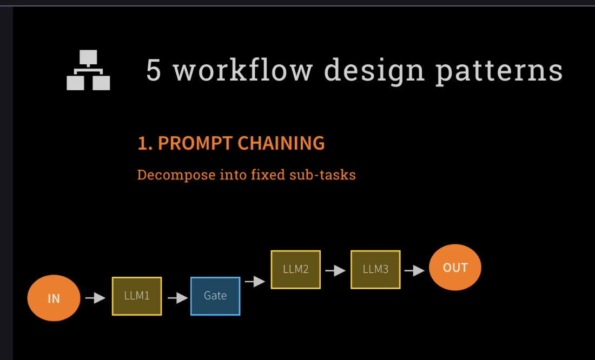
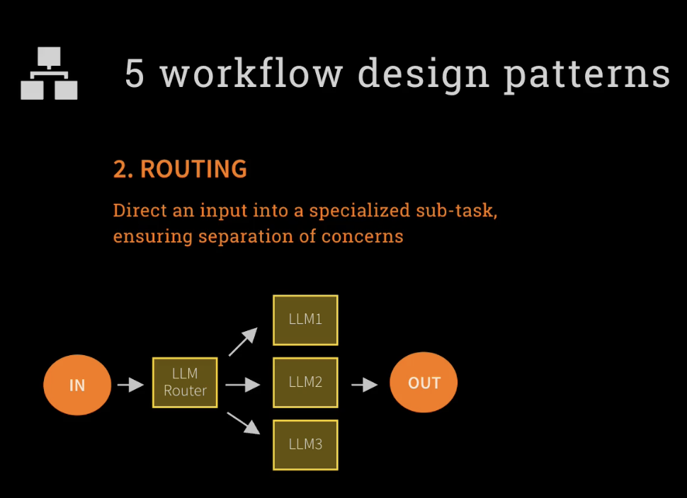
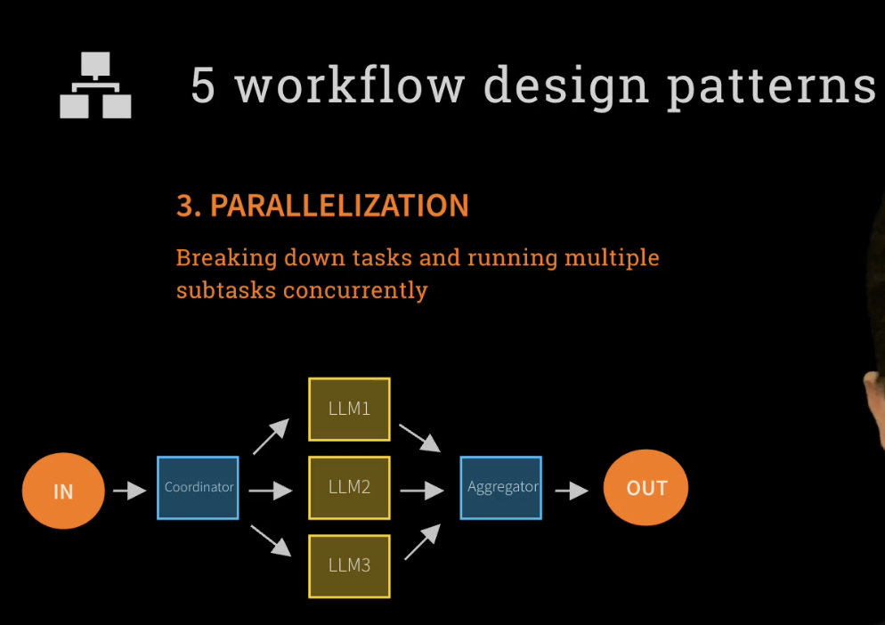
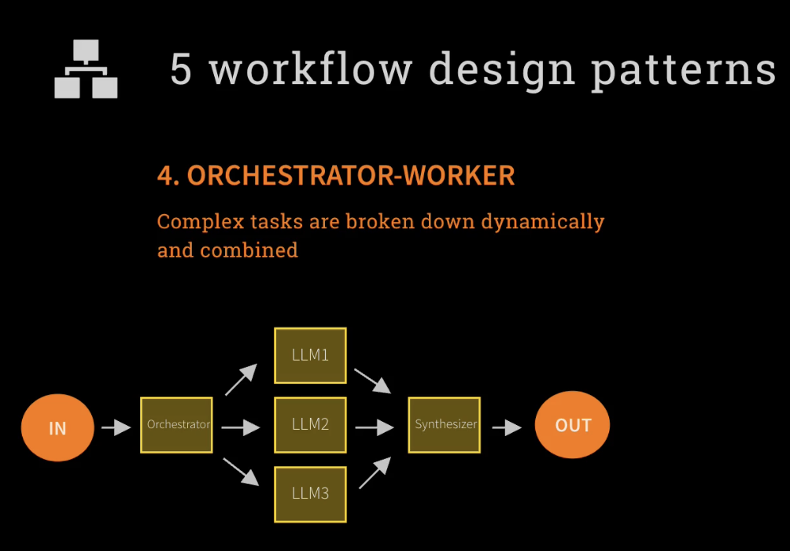
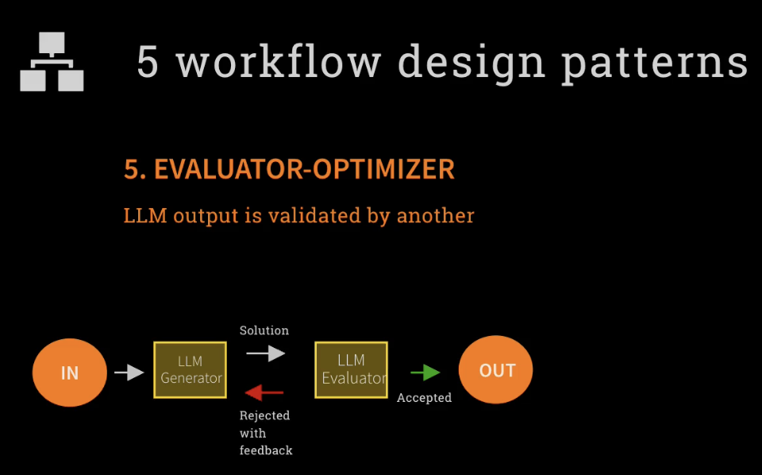
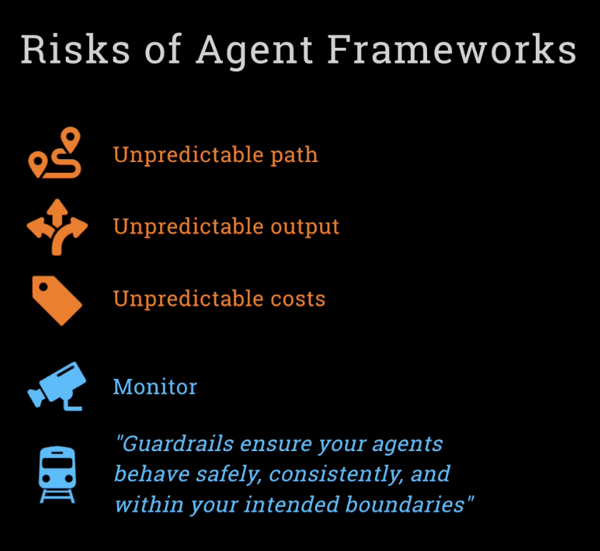
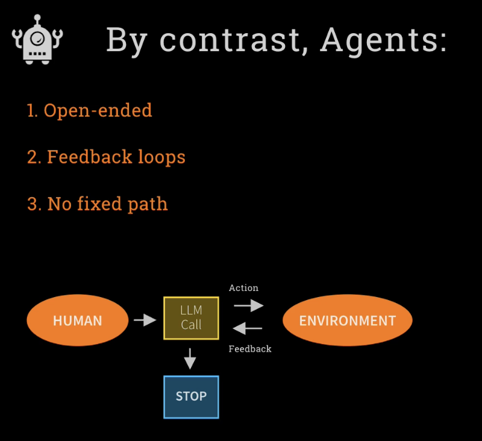

# LLM Workflow Design Patterns

This document outlines 5 essential workflow design patterns for building effective Large Language Model (LLM) applications and agentic AI systems.

## References

- **Course**: [The Complete Agentic AI Engineering Course](https://www.udemy.com/course/the-complete-agentic-ai-engineering-course/)
- **Specific Lecture**: [5 Workflow Design Patterns](https://www.udemy.com/course/the-complete-agentic-ai-engineering-course/learn/lecture/49770901#overview)
- **Instructor**: Ed Donner
- **Date Accessed**: July 26, 2025

## Overview

These patterns represent common architectural approaches for structuring LLM-based workflows, each optimized for different use cases and requirements:

### Workflow Patterns:
1. **Prompt Chaining** - Sequential task decomposition
2. **Routing** - Intelligent task distribution  
3. **Parallelization** - Concurrent processing
4. **Orchestrator-Worker** - Dynamic task coordination
5. **Evaluator-Optimizer** - Quality assurance and improvement

### Agent Design Considerations:
6. **Agent Frameworks vs. Custom Agents** - Understanding risks and benefits

---

## 1. PROMPT CHAINING

**Purpose**: Decompose complex tasks into fixed sub-tasks that execute sequentially.



**Architecture**:
```
IN → LLM1 → Gate → LLM2 → LLM3 → OUT
```

**When to Use**:
- Complex tasks that can be broken into logical steps
- When each step depends on the previous step's output
- Linear workflows with clear dependencies

**Benefits**:
- Clear, predictable workflow
- Easy to debug and maintain
- Good for step-by-step reasoning tasks

**Examples**:
- Research → Analysis → Summary → Report
- Data extraction → Processing → Validation → Output
- Problem identification → Solution design → Implementation plan

---

## 2. ROUTING

**Purpose**: Direct input to specialized sub-tasks, ensuring separation of concerns.



**Architecture**:
```
         ↗ LLM1
IN → Router → LLM2 → OUT
         ↘ LLM3
```

**When to Use**:
- Different types of inputs require different processing
- Need specialized models for specific domains
- Want to optimize performance by using targeted models

**Benefits**:
- Efficient resource utilization
- Specialized processing for different input types
- Can use different model sizes/types for different tasks

**Examples**:
- Customer service: Technical → Tech Support, Billing → Finance, General → FAQ
- Content analysis: Text → NLP model, Images → Vision model, Code → Code model
- Language detection → Language-specific processing

---

## 3. PARALLELIZATION

**Purpose**: Break down tasks and run multiple subtasks concurrently for speed and efficiency.



**Architecture**:
```
              ↗ LLM1 ↘
IN → Coordinator → LLM2 → Aggregator → OUT
              ↘ LLM3 ↗
```

**When to Use**:
- Independent subtasks that can run simultaneously
- Need to reduce overall processing time
- Tasks that benefit from multiple perspectives

**Benefits**:
- Faster processing through concurrency
- Can handle larger workloads
- Multiple approaches can improve accuracy

**Examples**:
- Document analysis: Summary + Sentiment + Key points in parallel
- Research: Multiple sources searched simultaneously
- Content generation: Multiple drafts generated and combined

---

## 4. ORCHESTRATOR-WORKER

**Purpose**: Complex tasks are broken down dynamically and combined intelligently.



**Architecture**:
```
              ↗ LLM1 ↘
IN → Orchestrator → LLM2 → Synthesizer → OUT
              ↘ LLM3 ↗
```

**When to Use**:
- Complex, adaptive workflows
- When the number and type of subtasks depend on the input
- Need intelligent coordination between components

**Benefits**:
- Flexible, adaptive processing
- Can handle varying complexity
- Intelligent task decomposition and synthesis

**Examples**:
- Creative writing: Plot → Characters → Dialogue → Integration
- Problem-solving: Analysis → Multiple solution approaches → Best solution selection
- Project planning: Requirements → Resource allocation → Timeline → Risk assessment

---

## 5. EVALUATOR-OPTIMIZER

**Purpose**: LLM output is validated and improved by another LLM in a feedback loop.



**Architecture**:
```
IN → LLM Generator ⟷ LLM Evaluator → OUT
     (Solution)      (Accepted/Rejected
                      with feedback)
```

**When to Use**:
- Quality is critical
- Need iterative improvement
- Want to catch and correct errors

**Benefits**:
- Higher quality outputs
- Self-improving systems
- Reduced hallucinations and errors

**Examples**:
- Code generation → Code review → Refinement
- Writing → Editing → Revision
- Mathematical reasoning → Verification → Correction

---

## 6. AGENT DESIGN CONSIDERATIONS

**Purpose**: Understanding the trade-offs between using agent frameworks versus building custom agent solutions.



### Risks of Agent Frameworks

Agent frameworks can introduce several unpredictable elements:

#### 🗺️ **Unpredictable Path**
- Agents may take unexpected routes to solve problems
- Difficult to trace decision-making process
- Can lead to inefficient or suboptimal solutions

#### 🔄 **Unpredictable Output**
- Results may vary significantly between runs
- Quality and format inconsistency
- Difficult to ensure reproducible results

#### 💰 **Unpredictable Costs**
- Token usage can vary dramatically
- Difficult to budget and predict expenses
- May result in unexpectedly high API costs

#### 📊 **Need for Monitoring**
- Requires continuous observation and intervention
- Must implement guardrails and safety measures
- Essential to track performance and behavior

#### 🚧 **Guardrails Essential**
> *"Guardrails ensure your agents behave safely, consistently, and within your intended boundaries"*



### Agent Characteristics

By contrast, well-designed agents should be:

#### 1. **Open-ended**
- Capable of handling diverse inputs and scenarios
- Adaptable to changing requirements
- Can explore multiple solution paths

#### 2. **Feedback loops**
- Learn from previous interactions
- Improve performance over time
- Self-correcting mechanisms

#### 3. **No fixed path**
- Dynamic decision-making capabilities
- Can adapt strategy based on context
- Flexible problem-solving approach

**Agent Architecture**:
```
HUMAN → LLM Call ⟷ ENVIRONMENT
          ↓       (Action/Feedback)
        STOP
```

### When to Use Agent Frameworks vs. Custom Solutions

| Scenario | Recommended Approach | Reason |
|----------|---------------------|---------|
| **Predictable workflows** | Workflow Patterns (1-5) | More control, lower cost, predictable |
| **Creative/exploratory tasks** | Agent Frameworks | Benefit from open-ended exploration |
| **High-stakes applications** | Workflow Patterns + Custom Logic | Need maximum control and predictability |
| **Rapid prototyping** | Agent Frameworks | Faster to implement and test |
| **Production systems** | Hybrid (Frameworks + Guardrails) | Balance flexibility with control |

### Best Practices for Agent Design

1. **Start with Workflow Patterns**: Use simpler patterns first before moving to agents
2. **Implement Guardrails**: Always include safety and boundary controls
3. **Monitor Extensively**: Track costs, performance, and behavior
4. **Test Thoroughly**: Agents can behave unexpectedly in edge cases
5. **Plan for Variability**: Build systems that can handle inconsistent outputs
6. **Cost Management**: Set limits and monitoring for API usage
7. **Human Oversight**: Include human-in-the-loop for critical decisions

---

## Pattern Selection Guide

| Use Case | Primary Pattern | Secondary Pattern |
|----------|----------------|-------------------|
| **Sequential Analysis** | Prompt Chaining | Evaluator-Optimizer |
| **Content Classification** | Routing | - |
| **Bulk Processing** | Parallelization | Orchestrator-Worker |
| **Creative Tasks** | Orchestrator-Worker | Evaluator-Optimizer |
| **High-Quality Output** | Evaluator-Optimizer | Prompt Chaining |
| **Real-time Systems** | Routing | Parallelization |
| **Research Tasks** | Parallelization | Prompt Chaining |
| **Exploratory/Adaptive Tasks** | Agent Frameworks | Orchestrator-Worker |
| **Unpredictable Environments** | Agent Frameworks | Evaluator-Optimizer |

---

## Implementation Considerations

### Performance
- **Prompt Chaining**: Sequential, slower but reliable
- **Routing**: Fast, efficient resource usage
- **Parallelization**: Fastest for independent tasks
- **Orchestrator-Worker**: Variable, depends on complexity
- **Evaluator-Optimizer**: Slower due to iteration, but highest quality

### Complexity
- **Routing**: Simplest to implement
- **Prompt Chaining**: Low complexity
- **Parallelization**: Medium complexity (coordination needed)
- **Orchestrator-Worker**: High complexity (dynamic orchestration)
- **Evaluator-Optimizer**: Medium complexity (feedback loops)

### Cost
- **Routing**: Most cost-effective (targeted processing)
- **Prompt Chaining**: Low to medium cost
- **Parallelization**: Higher cost (multiple concurrent calls)
- **Orchestrator-Worker**: Variable cost
- **Evaluator-Optimizer**: Highest cost (multiple iterations)

---

## Best Practices

1. **Start Simple**: Begin with Prompt Chaining or Routing before moving to complex patterns
2. **Combine Patterns**: Use multiple patterns together (e.g., Routing + Parallelization)
3. **Monitor Performance**: Track latency, cost, and quality metrics
4. **Error Handling**: Implement robust error handling, especially for parallel and orchestrated workflows
5. **Testing**: Test each component independently before integration
6. **Caching**: Cache intermediate results to reduce costs and improve performance

---

## Framework Examples

These patterns can be implemented using various frameworks:

- **LangChain**: Good for Prompt Chaining and basic Routing
- **LangGraph**: Excellent for Orchestrator-Worker and complex workflows
- **AutoGen**: Strong for multi-agent systems and Evaluator-Optimizer patterns
- **CrewAI**: Specialized for collaborative agent workflows
- **Custom Implementation**: Maximum flexibility for any pattern

---

# LLM Agents Design Pattern
